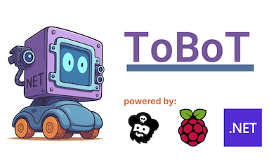
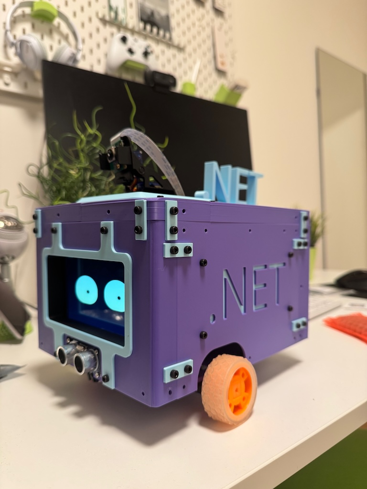
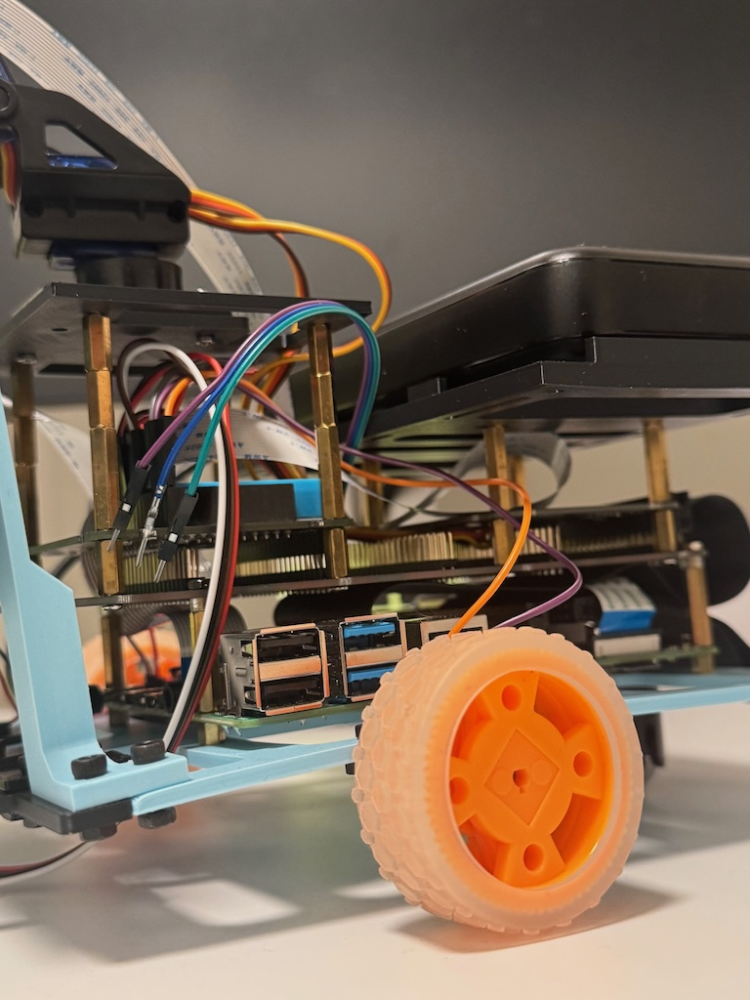
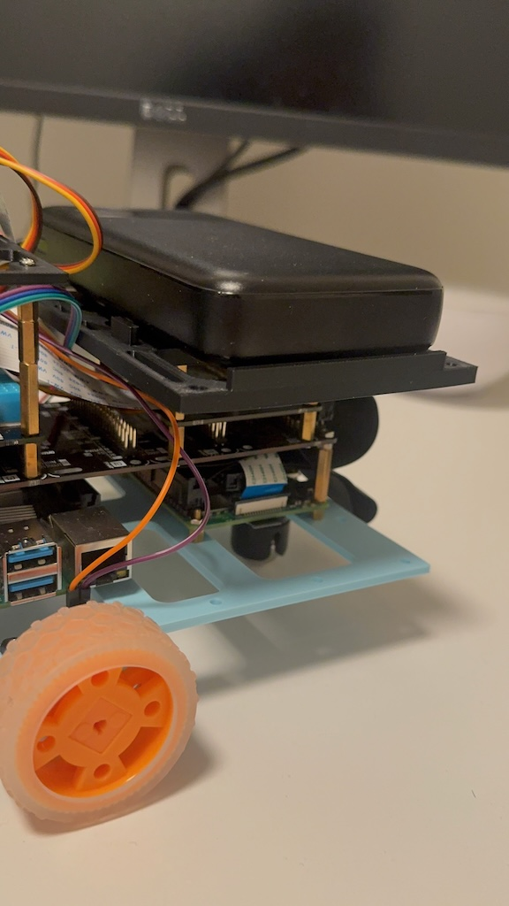
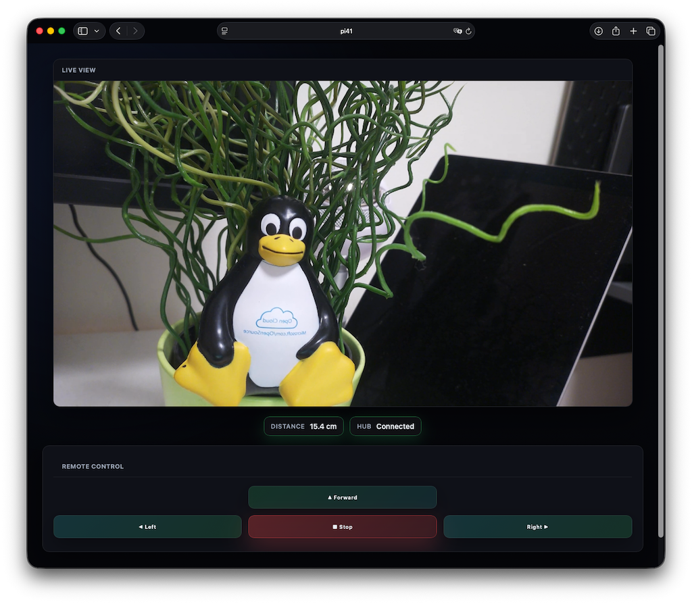
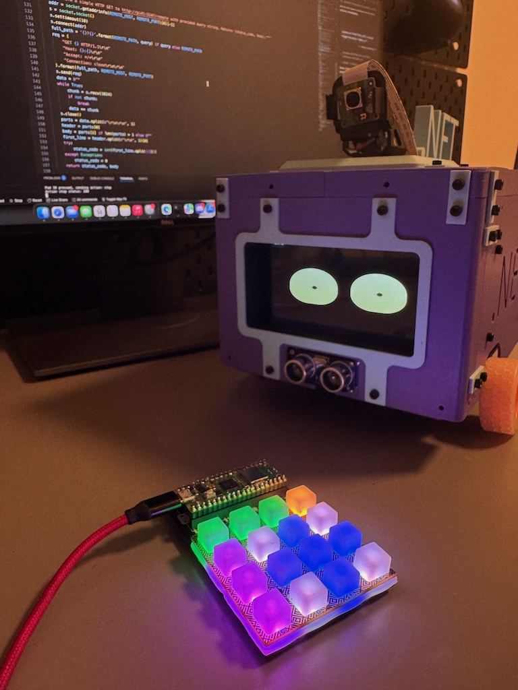
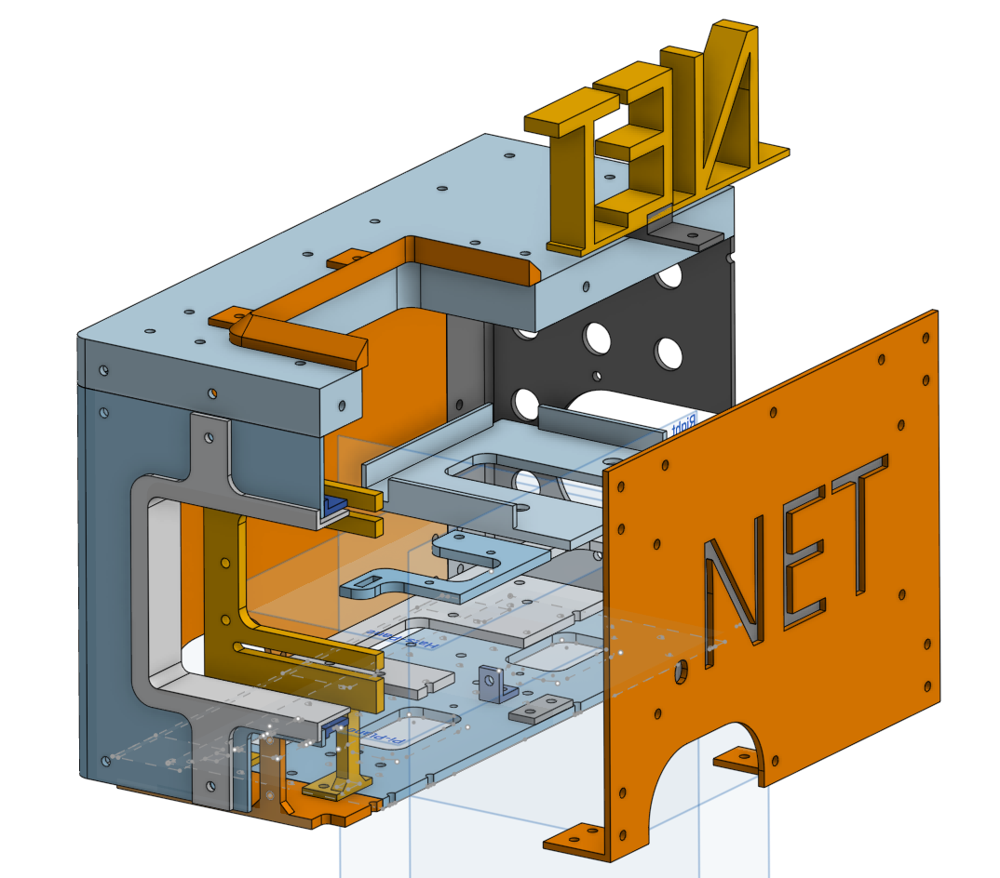
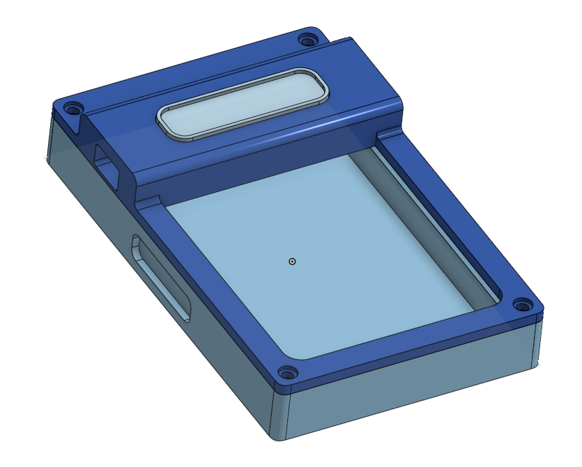

# 🤖 Tobot - .NET Robotics Platform for Raspberry Pi

> **Modern robotics meets modern .NET** - A unified C# driver and demo platform for Pimoroni Explorer HAT, Pan-Tilt HAT, and ultrasonic sensors on Raspberry Pi

[](https://dotnet.microsoft.com/)
[](https://docs.microsoft.com/en-us/dotnet/csharp/)
[](https://www.raspberrypi.org/)
[](LICENSE)

---

## ? What is Tobot?

**Tobot** is a complete .NET robotics platform combining custom 3D-printed hardware with professional-grade software to create a powerful, extensible robot built for the future. Based on a collection of exceptional **Pimoroni** components (Explorer HAT Pro, Pan-Tilt HAT, Stack HAT, Blinkt!, and more), Tobot features a **fully custom-designed chassis** that you can print and assemble yourself on compact 3D printers.

At its core, Tobot is designed to run on **two Raspberry Pi boards** working in tandem—providing ample compute power for computer vision, machine learning, autonomous navigation, and real-time control. One Pi handles hardware interfacing and motor control, while the second can focus on AI workloads, web services, or video processing.

The software stack centers around the `TobotController`, a unified C# API that orchestrates every sensor, motor, LED, and servo. Whether you're building your first robot, teaching programming, experimenting with edge AI, or creating a sophisticated autonomous system, Tobot provides everything you need in a clean, scalable, and well-documented platform.

### ✨ Why Tobot?

- **⚡ Modern C#** - Leverage C# 13 and .NET 10 features for robotics
- **📦 Package-Based Architecture** - Logical organization by functionality
- **📚 Comprehensive Documentation** - XML docs on every member, extensive guides
- **🎯 Ready-to-Run Demos** - Interactive examples for every feature
- **🔌 Unified Controller** - One `TobotController` surfaces every LED, motor, sensor, and servo
- **✅ Production Ready** - Robust error handling and resource management
- **🎓 Educational** - Perfect for learning robotics and C# together

---

## How it looks

### Tobot
<div align="center" style="display:flex; gap:12px; justify-content:center; flex-wrap:wrap;">
    
    
    
</div>

### Tobot.Web
<div align="center" style="display:flex; gap:12px; justify-content:center; flex-wrap:wrap;">
    
</div>

### Tobo.PicoRemote
<div align="center" style="display:flex; gap:12px; justify-content:center; flex-wrap:wrap;">
    
</div>

### CAD constructions
<div align="center" style="display:flex; gap:12px; justify-content:center; flex-wrap:wrap;">
    
    
</div>
---

## What Tobot is Based On

### 🏗️ Chassis

The Tobot chassis is **fully custom designed** and optimized for accessibility and ease of manufacturing. All parts are specifically engineered to fit on **small 3D printers** like the **BambuLab A1 mini**, making it possible to build your own robot without needing industrial-scale equipment.

**Key Features:**
- Optimized for compact bed sizes (180×180mm print area)
- Uses standard **PLA filament** - no exotic materials needed
- Compatible with eco-friendly filament from [Recycling Fabrik](https://www.recyclingfabrik.com/) or [BambuLab](https://bambulab.com/)
- Modular design for easy assembly and modifications
- All STL files available in the repository for customization

Whether you're a hobbyist with a small printer or an educator setting up a classroom fleet, the Tobot chassis is designed to be practical, affordable, and sustainable.

---

### 🔧 Hardware

Tobot's hardware foundation is built on exceptional components from the amazing team at [**Pimoroni**](https://shop.pimoroni.com/), a company renowned for their creativity, quality, and maker-friendly products.

**Core Components:**

| Component                                                                                                                            | Description                                                           | Shop Link                                                                                                                 |
| ------------------------------------------------------------------------------------------------------------------------------------ | --------------------------------------------------------------------- | ------------------------------------------------------------------------------------------------------------------------- |
| **[Explorer HAT Pro](https://shop.pimoroni.com/products/explorer-hat)**                                                              | Motor drivers, LEDs, analog inputs, digital I/O, and capacitive touch | [Buy Now](https://shop.pimoroni.com/products/explorer-hat)                                                                |
| **[pHAT Stack HAT](https://shop.pimoroni.com/products/phat-stack?srsltid=AfmBOooMtYout7YyKwNvmt7mzZK2IQPd3pf0JJF4NLPTJSem_P65BVwC)** | Stacking connector for adding multiple HATs                           | [Buy Now](https://shop.pimoroni.com/products/phat-stack?srsltid=AfmBOooMtYout7YyKwNvmt7mzZK2IQPd3pf0JJF4NLPTJSem_P65BVwC) |
| **[Pan-Tilt HAT](https://shop.pimoroni.com/products/pan-tilt-hat)**                                                                  | Servo-driven camera mount for dynamic viewing                         | [Buy Now](https://shop.pimoroni.com/products/pan-tilt-hat)                                                                |
| **[Blinkt!](https://shop.pimoroni.com/products/blinkt)**                                                                             | 8 RGB LED strip for visual feedback                                   | [Buy Now](https://shop.pimoroni.com/products/blinkt)                                                                      |

**Additional Components:**
- HC-SR04 ultrasonic distance sensor
- Standard jumper wires for flexible connections
- Raspberry Pi (any 40-pin GPIO model)
- 5V power supply (adequate for servos and motors)

**Current Setup:**  
The prototype uses **jumper wires** to connect components, providing flexibility during development and easy debugging. Future iterations may include custom PCBs or ribbon cable solutions for cleaner integration.

**Why Pimoroni?**  
Pimoroni's products are thoughtfully designed, thoroughly documented, and backed by an active community. Their commitment to open-source hardware and education aligns perfectly with Tobot's mission.

---

### 💻 Software

Tobot is built entirely on the **modern .NET ecosystem**, leveraging cutting-edge frameworks and libraries to deliver a professional, maintainable, and powerful robotics platform.

**Technology Stack:**

| Layer                       | Technology                 | Purpose                                      |
| --------------------------- | -------------------------- | -------------------------------------------- |
| **Framework**               | .NET 10                    | Modern runtime with C# 13 language features  |
| **Web UI**                  | ASP.NET Core Blazor        | Interactive, real-time web interface         |
| **Real-time Communication** | SignalR                    | Bidirectional communication for live updates |
| **Hardware Access**         | System.Device.Gpio NuGet   | Low-level GPIO, I2C, PWM control             |
| **Operating System**        | Raspberry Pi OS (Bookworm) | Official, stock Raspberry Pi distribution    |

**Why .NET?**
- **Cross-platform**: Runs natively on ARM-based Raspberry Pi
- **Performance**: Compiled code with optimized memory management
- **Tooling**: World-class IDEs (Visual Studio, VS Code) with IntelliSense and debugging
- **Modern Language**: C# 13 with pattern matching, async/await, and strong typing
- **Ecosystem**: NuGet package ecosystem with thousands of libraries
- **Long-term Support**: Microsoft's commitment to .NET on IoT

**Architecture Highlights:**
- **Unified Controller**: `TobotController` abstracts all hardware complexity
- **Package-based Organization**: Clean separation of concerns by functionality
- **XML Documentation**: Every public API is fully documented
- **Async/Await**: Non-blocking operations for responsive control
- **Resource Safety**: Proper disposal patterns throughout

No custom kernel modules, no modified OS images - just standard Raspberry Pi OS with .NET SDK installed. This makes Tobot easy to set up, maintain, and extend.

---

## ⚡ Quick Demo

```csharp
using Tobot.Device;

// Initialize the unified controller (all hats + sensors)
using var controller = new TobotController();

// Light show!
controller.SetAllLeds(true);

// Drive forward
controller.DriveMotors(100, 100);

// React to sensors
if (controller.ReadDigitalInput(1))
{
    controller.StopMotors();
    controller.SetAllLeds(false);
}

// Read analog sensors
double voltage = controller.ReadAnalogValue(1);
Console.WriteLine($"Sensor: {voltage:F2}V");

// Touch detection
if (controller.ReadTouchSensor(1))
{
    Console.WriteLine("Button pressed!");
}
```

---

## 🎯 What's Included?

### 📦 Tobot.Device Library

A professional-grade driver library for the Explorer HAT with:

| Package        | Components                             | Description                                |
| -------------- | -------------------------------------- | ------------------------------------------ |
| **🚗 Motor**    | `Motor`, `MotorCollection`             | H-bridge motor control with variable speed |
| **💡 LED**      | `Led`, `LedCollection`                 | Onboard LED control and patterns           |
| **📊 Analog**   | `AnalogInput`, `AnalogInputCollection` | 0-5V analog input via ADS1015 ADC          |
| **🔌 Digital**  | `DigitalInput/Output`, Collections     | Digital I/O with event support             |
| **👆 Touch**    | `TouchSensor`, `TouchCollection`       | Capacitive touch via CAP1208               |
| **📐 Distance** | `HcSr04Sensor`                         | Ultrasonic range finding with averaging    |

#### 🧭 Pan-Tilt HAT

Support for the Pimoroni Pan-Tilt HAT is baked into `TobotController`, which proxies every motion command to the onboard microcontroller at I2C address `0x15` (same protocol as the official Python library).

- Access via `TobotController.SetPanAngle`, `SetTiltAngle`, `PanTilt`, and `GetPanTiltAngles`
- Configurable idle timeout (query with `GetPanTiltIdleTimeout`)
- Automatic servo enable/disable and retry handling

Example:

```csharp
using Tobot.Device;

using var controller = new TobotController();

// Center
controller.PanTilt(0, 0);

// Move
controller.SetPanAngle(30);
controller.SetTiltAngle(-10);

// Read back (optional)
var (pan, tilt) = controller.GetPanTiltAngles();
Console.WriteLine($"Pan: {pan}°, Tilt: {tilt}°");
```

Notes:
- Requires I2C enabled on the Pi (`raspi-config`) and device visible at `0x15` (`i2cdetect -y 1`).
- Servos need an adequate 5V supply connected to the HAT; the Pi’s USB power is not sufficient to drive servos.
- Default servo pulse range is 575–2325 µs (≈ -90°…+90°). Idle timeout defaults to 2s.

#### 📐 HC-SR04 Ultrasonic Distance

`TobotController` also wraps the HC-SR04 ultrasonic range finder via the `HcSr04Sensor` manager.

- Call `TryReadDistance` for non-throwing reads or `ReadDistance` to enforce a measurement
- Adjustable sample count for noise reduction (defaults to 5 readings)
- Shares the controller's GPIO instance so trigger/echo pins are automatically managed

Example:

```csharp
using Tobot.Device;

using var controller = new TobotController();

if (controller.TryReadDistance(out double distanceCm))
{
    Console.WriteLine($"Distance: {distanceCm:F1} cm");
}
else
{
    Console.WriteLine("Out of range or no echo detected.");
}
```

### 🎮 Tobot Console Application

An interactive showcase featuring:

- **LED Light Show** - Mesmerizing patterns and effects
- **Input Monitor** - Real-time digital input tracking
- **Output Control** - Power external devices
- **Analog Reader** - Sensor voltage monitoring
- **Motor Control** - Precision movement and speed
- **Touch Demo** - Capacitive touch detection
- **Robot System** - Complete autonomous control
- **System Check** - Hardware diagnostics

### 🌐 Tobot.Web Application

A modern web-based control interface featuring:

- **SignalR Integration** - Real-time bidirectional communication
- **Remote Control** - Control your robot from any device on the network
- **Live Updates** - Receive real-time feedback from all sensors and actuators
- **Interactive UI** - Clean, responsive Blazor interface
- **Event Monitoring** - Track all robot actions in real-time
- **Multi-Device Support** - Access from phones, tablets, or computers
- **URL-Triggered Actions** - Trigger robot commands via query parameters

#### Available Pages

**Simple Control** (`/simple`)
- Styled button interface for motors, LEDs, and digital outputs
- Real-time event log showing all hub activity
- Speed control sliders for motors
- Connection status indicator

**Remote Control** (`/remote`)
- Minimal, unstyled button interface
- Supports query parameter `action` for URL-triggered commands
- Ideal for embedded frames or remote triggers

**Bot** (`/bot`)
- Animated reactive eyes with mood states
- Distance sensor visualization
- Click-to-toggle random autonomous driving
- Responsive mood changes based on sensor data

#### Remote Control Query Parameters

The `/remote` page supports triggering actions via URL query parameter `action`:

```
http://[raspberry-pi-ip]:5247/remote?action=forward
http://[raspberry-pi-ip]:5247/remote?action=backward
http://[raspberry-pi-ip]:5247/remote?action=stop
http://[raspberry-pi-ip]:5247/remote?action=left
http://[raspberry-pi-ip]:5247/remote?action=right
http://[raspberry-pi-ip]:5247/remote?action=light-on
http://[raspberry-pi-ip]:5247/remote?action=light-off
```

Supported action values:
- **Movement**: `forward`, `backward`, `stop`, `left`, `right`
- **Lights**: `light-on` (or `lighton`), `light-off` (or `lightoff`)

Use cases:
- Trigger actions from external scripts or dashboards
- Create custom control buttons/links
- Automate robot behavior via HTTP requests

### 🎮 Tobot.PicoRemote Application

A wireless remote control firmware for the **Raspberry Pi Pico W** with **Pimoroni PicoKeypad**, enabling control of Tobot from a handheld 16-button wireless controller.

Features:
- **16-Key RGB Keypad** - Intuitive button layout with visual LED feedback
- **WiFi Connectivity** - Sends HTTP GET requests to Tobot.Web's `/remote` endpoint
- **Status Indicators** - Real-time LED display of boot, WiFi, and remote endpoint status
- **Controller Layout**:
  - Directional controls: Up (forward), Down (backward), Left, Right
  - Center Stop button
  - Special function keys for Light On/Off and additional controls
- **Configuration** - Easily customizable host, port, and key mappings

Requirements:
- Raspberry Pi Pico W (WiFi capable)
- Pimoroni PicoKeypad (16 RGB backlit keys)
- MicroPython with `picokeypad` library
- WiFi credentials in `secret.py` (SSID and PASSWORD)
- Network access to Tobot.Web application

Usage:
```bash
# Configure WiFi credentials
echo "SSID = 'your-wifi-name'" > Tobot.PicoRemote/secret.py
echo "PASSWORD = 'your-wifi-password'" >> Tobot.PicoRemote/secret.py

# Upload remote-control.py to Pico W via Thonny or similar
# The firmware will auto-start and connect to your Tobot.Web instance
```

Note: Update `REMOTE_HOST` and `REMOTE_PORT` in `remote-control.py` to match your Tobot.Web deployment.

---

## 🚀 Quick Start

### Prerequisites

- Raspberry Pi (any model with 40-pin GPIO)
- Pimoroni Explorer HAT
- Pimoroni PanTilt HAT
- HC-SR04 ultrasonic sensor
- .NET 10 SDK

### Installation

```bash
# Clone the repository
git clone https://github.com/yourusername/tobot.git
cd tobot

# Build the solution
dotnet build

# Run the interactive demo
dotnet run --project Tobot
```

### Your First Robot in 30 Seconds

```bash
# Quick system check
dotnet run --project Tobot check

# LED light show
dotnet run --project Tobot led

# Full robot control
dotnet run --project Tobot robot
```

📖 **Detailed instructions:** See [Tobot/QUICKSTART.md](Tobot/QUICKSTART.md)

---

## 🧰 Scripts

All helper scripts live in `scripts/` at the project root.

- `scripts/run-tobot-web-kiosk.sh`: Starts the `Tobot.Web` Blazor app and opens it in Firefox kiosk mode on the Raspberry Pi at `http://localhost:5247/simple`.

Usage:

```bash
chmod +x scripts/run-tobot-web-kiosk.sh
./scripts/run-tobot-web-kiosk.sh
```

Notes:
- Requires `firefox` (or `firefox-esr`) installed on the Raspberry Pi.
- Binds the web app to `0.0.0.0:5247` so it’s reachable on your LAN.
- Adjust the script if you prefer Chromium (`chromium-browser --kiosk`).

---

## 🏛️ Architecture

Tobot follows a clean, modular architecture:

```
Tobot/
├── Tobot/                             Console demo application
│   ├── Program.cs                     Interactive demos
│   ├── README.md                      Usage guide
│   └── QUICKSTART.md                  5-minute setup
│
├── Tobot.Device/                      Hardware driver library
│   ├── ExplorerHat/                   Explorer HAT components
│   │   ├── ExplorerHat.cs             Main controller
│   │   ├── Motor/                     Motor control package
│   │   ├── Led/                       LED control package
│   │   ├── Analog/                    Analog input package
│   │   ├── Digital/                   Digital I/O package
│   │   └── Touch/                     Touch sensor package
│   ├── HcSr04/                        Ultrasonic distance helpers
│   │   └── HcSr04.cs                  High-level HC-SR04 manager
│   └── PanTiltHat/                    Pan-Tilt HAT (MCU @ 0x15)
│       ├── PanTiltHat.cs              High-level pan/tilt API (MCU protocol)
│       └── Pca9685.cs                 (Optional) PCA9685 helper (not required for MCU mode)
│
├── Tobot.Web/                         Web control interface
│   ├── Program.cs                     ASP.NET Core application
│   ├── Hubs/                          SignalR hubs
│   │   ├── TobotHub.cs                Main control hub
│   │   └── TobotHubEvents.cs          Event constants
│   └── Components/                    Blazor UI components
│       └── Pages/                     Web pages
│           ├── Simple.razor           Styled control interface
│           ├── Remote.razor           URL-triggered control interface
│           └── Bot.razor              Animated reactive eyes
│
└── Tobot.PicoRemote/                  Pico W wireless remote firmware
    ├── remote-control.py              Main firmware (MicroPython)
    └── secret.py.example              WiFi credentials template
```

### Key Design Principles

- Context-Related Packaging: Group by functionality for clarity
- Self-Contained Packages: Avoid cross-package dependencies
- Clean APIs: Intuitive, discoverable interfaces
- Comprehensive Docs: XML documentation across the codebase
- Resource Safety: Consistent `IDisposable` usage and cleanup

---

## 🎯 Features & Capabilities

All snippets below assume you have already created `var controller = new TobotController();` (or are inside a scope where a controller instance is available).

### 🚗 Motor Control
```csharp
controller.DriveMotor(1, 100);   // Full speed ahead
controller.DriveMotor(1, 75);    // 75% forward
controller.DriveMotor(1, -50);   // 50% backward
controller.StopMotors();         // Emergency stop
```

### 💡 LED Control
```csharp
controller.SetLedState(1, true); // Individual LED
controller.SetAllLeds(true);     // All LEDs
controller.ToggleLed(2);         // Toggle state
```

### 🔌 Digital I/O
```csharp
// Read input
bool state = controller.ReadDigitalInput(1);

// Event-driven
controller.RegisterInputChangedHandler(1, (s, e) =>
	Console.WriteLine($"Changed: {e.ChangeType}")
);

// Control output
controller.SetDigitalOutput(1, true);
controller.ToggleDigitalOutput(1);
```

### 📊 Analog Input (0-5V)
```csharp
double voltage = controller.ReadAnalogValue(1);
Console.WriteLine($"Voltage: {voltage:F2}V");
```

### 👆 Capacitive Touch
```csharp
if (controller.ReadTouchSensor(1))
{
	Console.WriteLine("Touched!");
}

byte allSensors = controller.ReadTouchState();
```

### 📐 Ultrasonic Distance (HC-SR04)
```csharp
if (controller.TryReadDistance(out double distanceCm, samples: 5))
{
    Console.WriteLine($"Distance: {distanceCm:F1} cm");
}
else
{
    Console.WriteLine("Measurement failed");
}
```

---

## 📚 Documentation

| Document                                                                                             | Description            |
| ---------------------------------------------------------------------------------------------------- | ---------------------- |
| [Tobot/README.md](Tobot/README.md)                                                                   | Demo application guide |
| [Tobot/QUICKSTART.md](Tobot/QUICKSTART.md)                                                           | 5-minute setup         |
| [Tobot.Device/ExplorerHat/README.md](Tobot.Device/ExplorerHat/README.md)                             | API reference          |
| [Tobot.Device/ExplorerHat/FILE_STRUCTURE.md](Tobot.Device/ExplorerHat/FILE_STRUCTURE.md)             | File organization      |
| [Tobot.Device/ExplorerHat/PACKAGE_ORGANIZATION.md](Tobot.Device/ExplorerHat/PACKAGE_ORGANIZATION.md) | Package guide          |

---

## 📖 Learning Resources

### Example Projects

1. **Line Following Robot**
   ```csharp
   // Use analog sensors to detect line
   double left = controller.ReadAnalogValue(1);
   double right = controller.ReadAnalogValue(2);
   
   if (left > 2.5) controller.DriveMotor(1, 50);
   if (right > 2.5) controller.DriveMotor(2, 50);
   ```

2. **Touch-Controlled Light Show**
   ```csharp
   for (int i = 1; i <= 4; i++)
   {
       if (controller.ReadTouchSensor(i))
           controller.ToggleLed(i);
   }
   ```

3. **Obstacle Avoiding Robot**
   ```csharp
   double distance = controller.ReadAnalogValue(1);
   if (distance > 3.0)
   {
       controller.StopMotors();
       controller.SetAllLeds(true); // Warning!
   }
   ```

### Code Examples

All demos in `Tobot/Program.cs` are fully commented and ready to modify. Each example is self-contained and demonstrates best practices.

---

## 🔧 Hardware Specifications

### Explorer HAT Features

| Feature             | Quantity | Specifications             |
| ------------------- | -------- | -------------------------- |
| **Digital Inputs**  | 4        | 5V tolerant, buffered      |
| **Digital Outputs** | 4        | 500mA sink-to-ground       |
| **Analog Inputs**   | 4        | 0-5V, 12-bit ADC (ADS1015) |
| **Motor Drivers**   | 2        | H-bridge, PWM capable      |
| **Onboard LEDs**    | 4        | Status indicators          |
| **Touch Sensors**   | 8        | Capacitive (CAP1208)       |

### Pin Mapping

<details>
<summary>🔍 Click to view complete pin mapping</summary>

#### Digital Inputs (BCM GPIO)
- Input 1: GPIO 23
- Input 2: GPIO 22
- Input 3: GPIO 24
- Input 4: GPIO 25

#### Digital Outputs (BCM GPIO)
- Output 1: GPIO 6
- Output 2: GPIO 12
- Output 3: GPIO 13
- Output 4: GPIO 16

#### LEDs (BCM GPIO)
- LED 1: GPIO 4
- LED 2: GPIO 17
- LED 3: GPIO 27
- LED 4: GPIO 5

#### Motors (BCM GPIO)
- Motor 1: Enable 19, Forward 20, Backward 21
- Motor 2: Enable 26, Forward 7, Backward 8

#### I2C Devices
- ADS1015 ADC: Address 0x48
- CAP1208 Touch: Address 0x28

</details>

---

## ⚙️ Advanced Usage

### Custom Robot Control Loop

```csharp
using var controller = new TobotController();

// Setup
controller.SetAllLeds(false);
controller.StopMotors();

// Main control loop
while (true)
{
    // Read sensors
    bool goButton = controller.ReadDigitalInput(1);
    bool stopButton = controller.ReadDigitalInput(2);
    double frontSensor = controller.ReadAnalogValue(1);
	
    // Decision logic
    if (stopButton || frontSensor > 3.0)
    {
        // Emergency stop
        controller.StopMotors();
        controller.SetLedState(1, true);
    }
    else if (goButton)
    {
        // Move forward
        controller.DriveMotors(80, 80);
        controller.SetLedState(2, true);
    }
    else
    {
        // Idle
        controller.StopMotors();
        controller.SetAllLeds(false);
    }
	
    await Task.Delay(50); // 20Hz update rate
}
```

### Async/Await Support

```csharp
public async Task MonitorSensorsAsync(CancellationToken ct)
{
    using var controller = new TobotController();
	
    while (!ct.IsCancellationRequested)
    {
        var voltage = controller.ReadAnalogValue(1);
        Console.WriteLine($"Sensor: {voltage:F2}V");
		
        await Task.Delay(100, ct);
    }
}
```

---

## 🤝 Contributing

This project welcome contributions! Whether it's:

- 🐛 Bug reports
- 💡 Feature requests  
- 📝 Documentation improvements
- 💻 Code examples
- 🔧 Driver enhancements

Please note, that I am developing this project for my self and there is no intend to make it a "market product" in sense of warranty, liability, etc.

For more, please see [CONTRIBUTING.md](CONTRIBUTING.md) for guidelines.

---

## 🗺️ Roadmap

### Current Features
- Complete Explorer HAT driver
- Pan-Tilt HAT (experimental)
- Interactive demo application
- Comprehensive documentation
- Package-based architecture

### 🔮 Planned Features 
- [X] PWM motor speed control
- [ ] Advanced pattern library
- [ ] Configuration system
- [ ] Logging framework
- [ ] Unit test coverage
- [ ] CI/CD pipeline

---

## 💻 Why .NET for Robotics?

### Modern Language Features
- **Pattern Matching** - Clean state machine logic
- **Async/Await** - Non-blocking sensor reading
- **LINQ** - Elegant data processing
- **Strong Typing** - Catch errors at compile time

### Excellent Tooling
- **Visual Studio / VS Code** - World-class IDEs
- **IntelliSense** - Discover APIs as you code
- **Debugging** - Full breakpoint support
- **Package Management** - NuGet ecosystem

### Performance
- **Native ARM** - Optimized for Raspberry Pi
- **Efficient Memory** - Garbage collection tuned for IoT
- **Low Latency** - Real-time control capable

---

## 🙏 Acknowledgments

- **Pimoroni** - For creating the amazing Explorer HAT hardware
- **.NET Team** - For bringing .NET to ARM/IoT devices
- **Open Source Community** - For inspiration and support

---

## 📄 License

This project is licensed under the MIT License - see [LICENSE](LICENSE) file for details.

---

## 🔗 Links

- **Hardware**: [Pimoroni Explorer HAT](https://shop.pimoroni.com/products/explorer-hat)
- **Documentation**: [.NET IoT Libraries](https://github.com/dotnet/iot)
- **Community**: [Raspberry Pi Forums](https://forums.raspberrypi.com/)
- **Support**: [Open an Issue](https://github.com/yourusername/tobot/issues)

---

## 🚀 Get Started Now!

```bash
git clone https://github.com/yourusername/tobot.git
cd tobot
dotnet run --project Tobot
```

**Ready to build something amazing?** The future of robotics is .NET! ???

---

<div align="center">

**Made with ❤️ for makers, educators, and robotics enthusiasts**

[⭐ Star this repo](https://github.com/yourusername/tobot) | [📚 Read the docs](Tobot/README.md) | [🚀 Quick start](Tobot/QUICKSTART.md)

</div>
